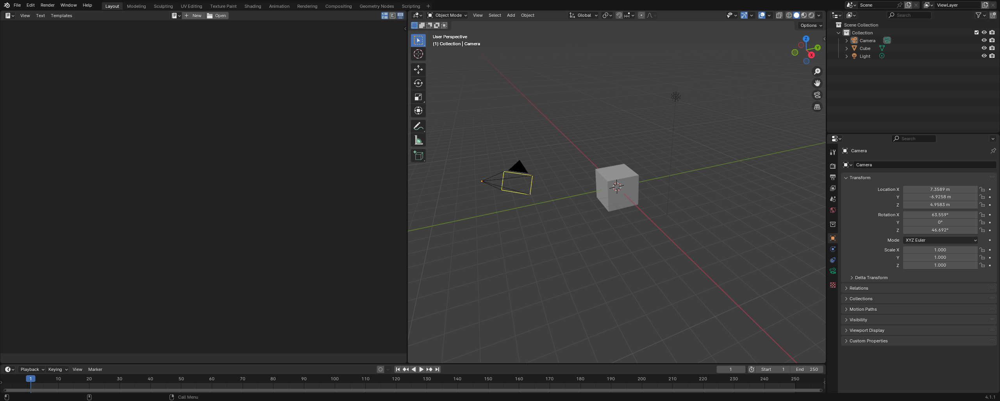

# Creating a Spline and Camera Track in Python

## Setting the environment:

We'll start by setting up our environment for an efficient workflow.

Let's load up Blender.

<figure><figcaption></figcaption></figure>

We can open a new window by clicking in the top left most corner, right below the blender logo, until a '+' sign shows up. If we drag this to the right, we can get a new workspace to the left.

Click on the editor type selection in the left workspace:

<figure><figcaption></figcaption></figure>

From here, select the "Text Editor" option under the "Scripting" column.

Our workspace should now look like this:

<figure><figcaption></figcaption></figure>

Within the Text Editor screen, click on the "Open" button, and within the file selector, navigate to the file titled "SplineCurvesScript.py".



<figure><figcaption></figcaption></figure>

We'll now customize our script and go over how it works.&#x20;

If you need to read in a csv of points, then the first step in this process is importing packages, which is overviewed in the next section. However, if you want to skip this step by writing the points as a tuple of lists within Python itself, then you can jump past the importing packages section, down to the appropriate steps within "[Customizing the script](creating-a-spline-and-camera-track-in-python.md#customizing-the-script)".

***

## Importing packages:

```r
import bpy
import pandas as pd
import numpy as np
```

While bpy and numpy are already installed in Python for Blender, we'll need to install pandas to run this code. This should only be done once.&#x20;

To install pandas through pip, we'll need to access the Python.exe (or python3.11 on Mac) file and use it to run a command through the Command Prompt or Terminal. The code should look something like this:

Windows:

```
"C:\Program Files\Blender Foundation\Blender 4.1\4.1\python\bin\python.exe" -m pip install pandas
```

Mac:

```
/Applications/Blender.app/Contents/Resources/4.1/python/bin/python3.11 -m pip install pandas
```

Once that runs, just restart Blender, making sure to save our progress so far so that we don't have to re-do any steps.

***

## Customizing the script:

Looking back to the Text Editor, there's two functions that make our program run: constructCurve() and cameraTrack(), which generates the curve and creates the camera tracking, respectively. The comments make the code easily interpretable, and any specific calls can be further understood by looking at the [Blender Python API Docs](https://docs.blender.org/api/current/).

After the functions are defined, we have a section of code dedicated to calling the functions and ultimately running our program. If we're loading the points from a csv, here, we should change the csv in the pd.read\_csv() call to the file that we want to read in:

```python
#read the csv containing our points 
coords_list = pd.read_csv('/Users/xxxxxx/points.csv', header=None)
```

Note that for our code to read in the data properly, we need the csv to be in a format similar to this (these are the points we'll be working with in this tutorial):

<figure><figcaption></figcaption></figure>

Notice that there aren't any headers. The data in the first column, "A" corresponds to the X coordinate of the 3D point. The data in the next column, "B", corresponds to the Y coordinate, and the data in "C" corresponds to the Z.

***

If we're not importing the points in from a csv, then we can edit the line containing a tuple of points:

```python
coords_list = ([0,-5,2],[-3.5,0,1],[0,1,0],[2,3,-1],[2,7,-1],[0.5,6,0])
```

Here, each index in the tuple contains a list of coordinates corresponding to an X, Y, and Z position (respectively) of a point. These are the same values as the csv file above, and will produce the exact same result.

Be sure to comment out any lines that may write over desired changes: if we're using the tuples method, then comment out the lines reading a csv and converting it to a list. Make sure to comment out the "import pandas as pd" line as well, since that will give us an error if pandas is not installed (installation is unnecessary if we're using tuples).&#x20;

***

There's one more change we need to make before we can run our code. Within the cameraTrack() method, we declare what object we want the camera to track. We should change this to the name of the object we want to track. In this example, the name of the object is "Cube" so we'll keep it like this:

```python
#we want the target to be the default "Cube" object
camera_obj.constraints["Track To"].target = bpy.data.objects["Cube"]
```

Keep in mind that you can see the list of objects and rename them via Outliner interface on the top right:

<figure><figcaption></figcaption></figure>

Let's also delete the Camera from the scene, since we'll be adding a new one with our script. Click on the camera in the scene or the collections menu, and press X to delete it.

***

## Running the script:

With all the changes made (the csv source, tracking object, and camera deletion), we can now run the script by pressing the triangle to the right of the .py file name:

<figure><figcaption></figcaption></figure>

We should get a spline connected with some points in our environment:

<figure><figcaption></figcaption></figure>

If we click the play button on the bottom of the screen, we should see the camera animating across the screen, following the spline, and tracking the cube object.

<figure><figcaption></figcaption></figure>

If the spline isn't added properly or the camera movement isn't as desired try opening the "Info" menu in our Blender environment. This gives us access to the traceback output, which might help debug code if needed.&#x20;

If we want better access to the data in our program, we can open up the System Console to see print statements. On Windows, this can be done by clicking Window, then "Toggle System Console". On Mac, we'll have to open Blender from the Terminal to gain access to the system console, which will then print on the Terminal itself. You can look into a tutorial on how to do that on Blender's [website](https://docs.blender.org/manual/en/latest/advanced/command\_line/launch/index.html).

From here, we could directly export our movie. However, if we want to edit our spline a bit more, we can do that through Blender. Click [here](../blender/creating-and-editing-a-spline-in-blender.md) to learn how. If we wanted to edit the camera movement more, we can also do that through Blender. Click [here](../blender/editing-a-camera-track-in-blender.md) to learn how.
